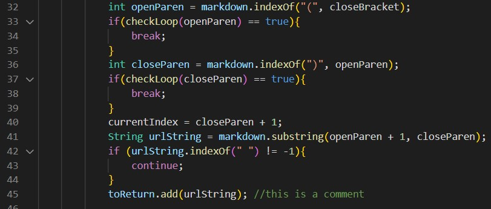

# Lab Report 5
*Edwin Ambrosio*

*3 June 2022*


## Explain
***

>How you found the tests with different results (Did you use vimdiff on the
results of running a bash for loop? Did you search through manually? Did you
use some other programmatic idea?)

I used the command vimdiff in order to find all the tests with different results.

```
vimdiff markdown-parser/results.txt otherMark/results.txt
```

> Provide a link to the test-file with different-results (in the provided repository or
your repository , either is fine)

[Test 1](https://github.com/eambrosio27/LR5/blob/main/573.md) is 573.md

[Test 2](https://github.com/eambrosio27/LR5/blob/main/496.md) is 496.md

## Test 1: 573.md
***
```
](/url2)
```

For Test #1, 573.md, my implementation is correct because this test case is an image, not a link, so it should return an empty list.

**Actual:**

> My MarkdownParse to the left, Lab 9 MarkdownParse to the right

**Expected:**


**Fix:**

In the other MarkdownParse, the reason the code does not run because
the implementation accounts for new lines but not "!" for images. So it reads the test file as if it were a link. Adding a test case before running the rest fo the code to
check for images would fix this implementation.


> The change can be made after line 57.

## Test 2: 496.md
***

```
[link](foo(and(bar))
```
The Lab 9 implementation is correct for 496.md because the preview shows there should be no links therefore the result should be an empty array.

**Actual:**


**Expected:**


**Fix:**

The problem here is that there are not enough ) to close the number of ( symbols in the file. Therefore the parenthesis never closes and does not clasify as a link. In order to fix this in my MarkdownParse, there has to be a test case that makes sure every open parenthesis is closed with a closed parenthesis. 


> The change can be made after line 35.